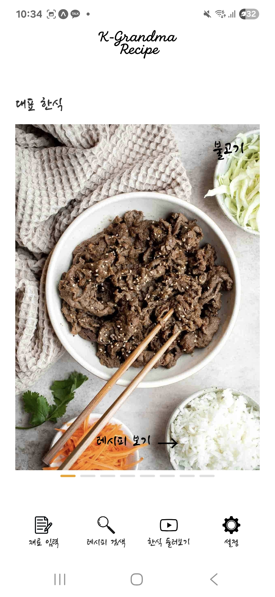
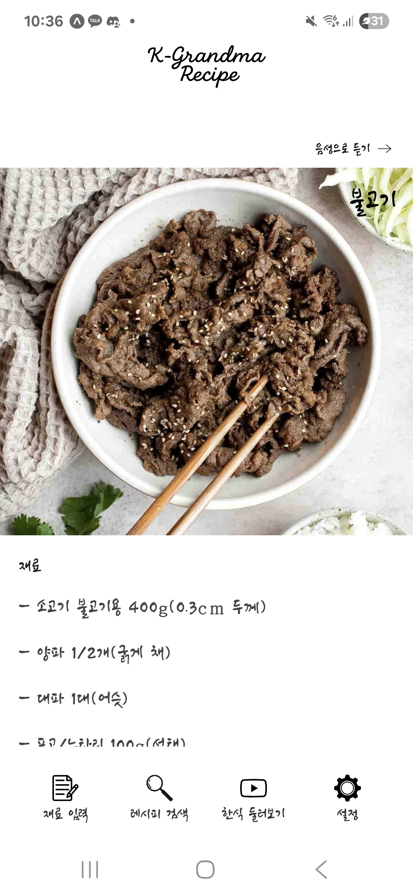
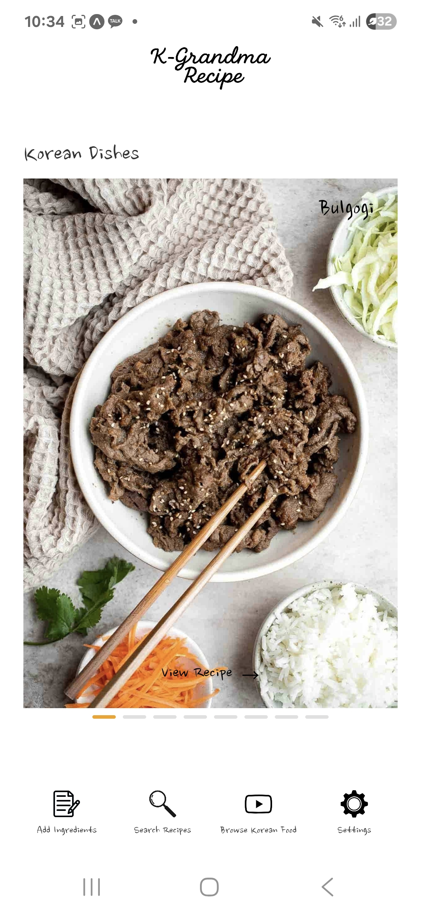
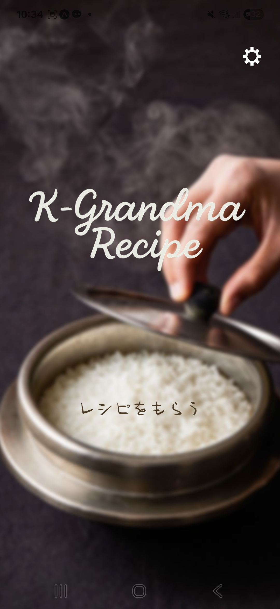
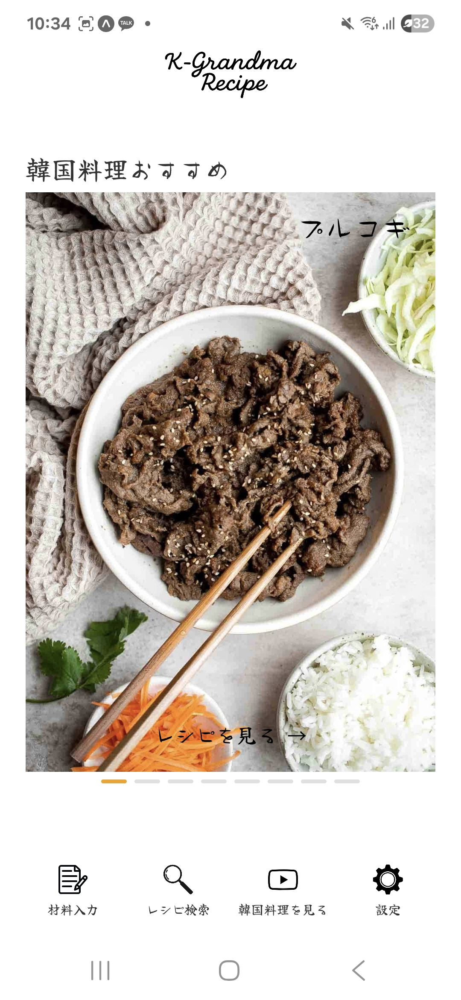

# K-Grandma recipe

**한국 할머니의 손맛, 모바일로.**  
**Home-style Korean dishes, guided by AI.**  
**AIが材料から作れる韓国家庭料理を提案します。**

---

## Features / 기능 / 機能

### 🇰🇷 기능
- **홈 화면 – 한국 대표 음식 추천**  
  첫 화면에서 계절·인기 한식을 선별해 보여줍니다.
- **재료 입력 – 냉장고 속 재료로 한식 추천 (AI)**  
  재료를 입력하면 AI가 지금 만들 수 있는 메뉴를 추천합니다.
- **레시피 검색 – 먹고 싶은 메뉴 바로 찾기**  
  한/영/일 검색 지원, 상세 레시피를 즉시 확인합니다.
- **한식 둘러보기 – YouTube 카테고리별 영상**  
  YouTube API로 카테고리별 레시피 영상을 모아봅니다.
- **세팅 – 한/영/일 다국어 지원**  
  언어를 즉시 전환할 수 있습니다.

### 🇺🇸 Features
- **Home – Curated Korean classics**  
  Seasonal and popular picks on launch.
- **Ingredient Input – AI from your fridge**  
  Enter what you have—AI suggests dishes you can cook now.
- **Recipe Search – Find what you crave**  
  Search in Korean/English/Japanese and get full recipes.
- **Browse – YouTube recipe videos by category**  
  Category feeds powered by the YouTube API.
- **Settings – Multilingual (KO/EN/JA)**  
  Instant language switching.

### 🇯🇵 機能
- **ホーム – 韓国の定番をキュレーション**  
  起動時に季節・人気メニューを厳選表示。
- **材料入力 – 冷蔵庫の食材からAIが提案**  
  手持ちの食材を入力すると、今作れる料理をおすすめ。
- **レシピ検索 – 食べたいものをすぐ発見**  
  韓/英/日で検索、詳細レシピを即表示。
- **ブラウズ – YouTube カテゴリ別レシピ動画**  
  YouTube API でカテゴリごとに視聴。
- **設定 – 多言語対応（韓/英/日）**  
  ワンタップで言語を切り替え。

---

## 소개 / About / について

### 🇰🇷 소개
K-Grandma recipe는 **재료 기반 AI 추천**과 **간결한 레시피 탐색**을 결합한 한식 플랫폼입니다.  
냉장고 속 재료로 오늘의 메뉴를 고르고, 영상/단계별 안내로 바로 따라 해보세요.

### 🇺🇸 About
K-Grandma recipe combines **AI ingredient recommendations** with a clean, distraction-free browsing experience.  
Tell us what’s in your fridge, get smart Korean dish ideas, then cook along with video or step-by-step instructions.

### 🇯🇵 について
K-Grandma recipe は、**材料ベースのAIおすすめ** と **見やすいレシピ検索** を備えた韓国料理アプリです。  
冷蔵庫の食材から作れる料理を提案し、動画や手順に沿ってそのまま作れます。

---

## Screenshots

> 각 언어별로 **홈 · 재료 입력 · 레시피** 순서입니다。/ In each language: **Home · Ingredients · Recipe**。/ 各言語：**ホーム · 材料入力 · レシピ**。

### 🇰🇷 Korean (ko)

  
  
  

홈 · 추천 음식 · 레시피

### 🇺🇸 English (en)

  
  
  

Home · Recommended food · Recipe

### 🇯🇵 Japanese (ja)

  
  
  

ホーム · おすすめの食べ物 · レシピ

---

## Localization
- Supported: **ko / en / ja**
- Asset structure:
